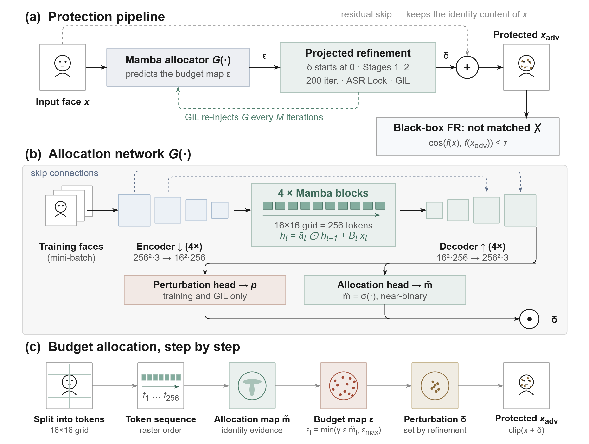

# SSM-Attack: Learning Where to Perturb for Black-Box Face Privacy

**Tunahan Parlayıcı¹, Erchan Aptoula¹, Yücel Saygın²**
¹ Computer Vision and Pattern Analysis Laboratory ([VPALab](https://www.vpalab.com)), Faculty of Engineering and Natural Sciences, Sabancı University, Istanbul, Türkiye  
² Faculty of Engineering and Natural Sciences, Sabancı University, Istanbul, Türkiye

> **Status:** The manuscript is under review. Code and pretrained models will be released in this repository upon acceptance. The release plan is listed below.

<p align="center">
  
</p>

## Overview

A photograph shared online can be matched to its owner by face recognition systems the owner never agreed to. SSM-Attack protects such photographs with a small, bounded perturbation that makes unseen face recognition models fail to match the person, while no pixel changes by more than a fixed amount.

The central idea is to separate two decisions. A selective state space model (Mamba) reads the face as a sequence of 256 tokens and decides **where** the perturbation budget should go, producing a per-pixel budget map. A short projected optimization then decides **how much**, setting the perturbation values inside that budget. The network never synthesizes the perturbation itself.

- **Allocation, not synthesis.** The network predicts a spatial budget map; the values come from projected refinement, so the per-pixel ℓ∞ bound (ε ≤ 0.10) holds at every step.
- **Strict black-box protocol.** Leave-one-out over four face recognition models: the held-out target is used neither in training nor at protection time, and it is never queried.
- **Compact.** The allocation network has 5.73M parameters (16.13M including the frozen networks used by the quality terms) and needs no retraining for new identities.

## Results

Attack success rate (%) at FAR@0.01 under face verification, for each held-out target model. MF is MobileFace.

| Test set | IR-152 | IRSE-50 | FaceNet | MF | **Avg.** | Best prior (reported) |
|---|---:|---:|---:|---:|---:|---|
| CelebA-HQ (1,000) | 95.20 | 87.60 | 80.40 | 85.20 | **87.10** | 79.28 (Adv-CPG) |
| LADN (332) | 93.07 | 96.99 | 67.47 | 90.06 | **86.90** | 79.97 (DiffAM) |
| FFHQ (1,000) | 92.70 | 79.60 | 70.90 | 81.40 | **81.15** | 80.02 (Adv-CPG) |

FFHQ results come from a network trained on CelebA-HQ and MT, so FFHQ is unseen both as a dataset and as a set of identities.

Image quality: SSIM 0.888, PSNR 28.42 dB and FID 53.6 on CelebA-HQ; SSIM 0.870 and PSNR 28.10 dB on LADN.

**A note on the metric.** SSM-Attack optimizes and reports untargeted *dodging*: a protected image counts as a success when it no longer matches its owner. Most compared methods report *impersonation* success toward a chosen target identity. The two rates answer different questions; the paper discusses the difference in the experimental setup section.

## Release plan

- [ ] Allocation network and protection pipeline (PyTorch; the selective scan is implemented in plain PyTorch, with no custom CUDA kernels)
- [ ] Training code for the leave-one-out protocol
- [ ] Evaluation code: attack success rate at FAR@0.01, SSIM, PSNR, FID
- [ ] Pretrained allocation networks, one per held-out target model
- [ ] Scripts for the budget-allocation ablations and the token-order permutation test

## Data and models

The experiments use CelebA-HQ, LADN and FFHQ for testing and the Makeup Transfer (MT) dataset for training, together with the publicly available IR-152, IRSE-50, FaceNet and MobileFace recognition models. None of these are redistributed here; please obtain them from their original sources under their respective licenses. References are given in the paper.

## Intended use

SSM-Attack is intended to help people protect their own photographs from unauthorized face recognition. It performs dodging only: a protected image stops matching its owner and is not made to match anyone else. Please do not use it to evade lawful identity verification or in any way that violates applicable law.

## Citation

The citation will be updated when the paper is published.

```bibtex
@misc{parlayici2026ssmattack,
  title  = {{SSM-Attack}: Learning Where to Perturb for Black-Box Face Privacy},
  author = {Parlay{\i}c{\i}, Tunahan and Aptoula, Erchan and Sayg{\i}n, Y{\"u}cel},
  year   = {2026},
  note   = {Manuscript under review}
}
```

## Acknowledgements

This work was supported by the Scientific and Technological Research Council of Türkiye (TÜBİTAK) under the 2244 Industrial Ph.D. Program.

## Contact

Tunahan Parlayıcı — tunahanp@sabanciuniv.edu
